# Mockup

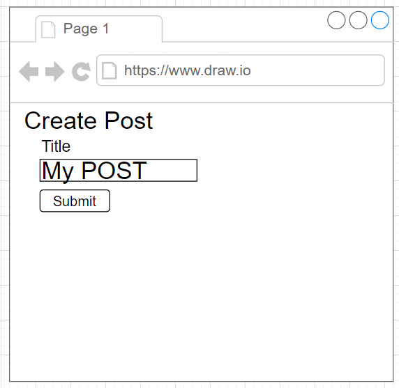
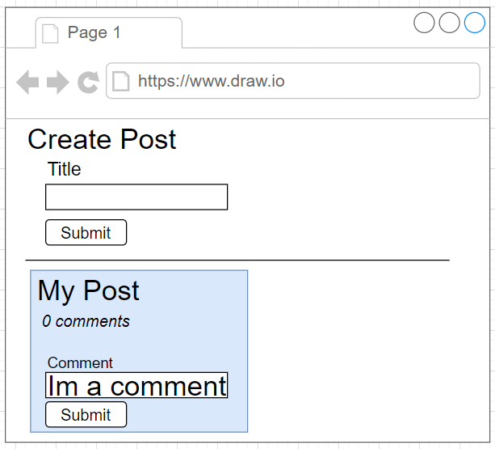
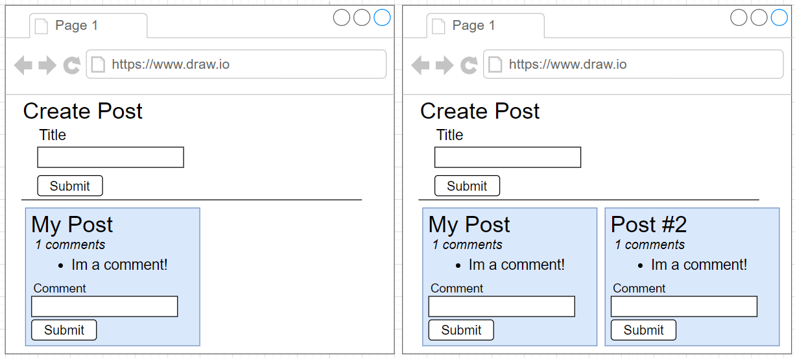

# Design

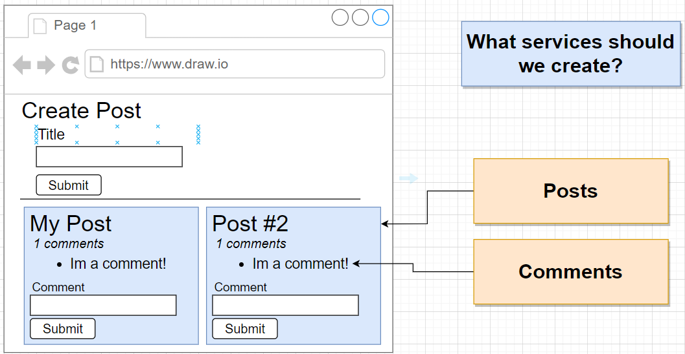

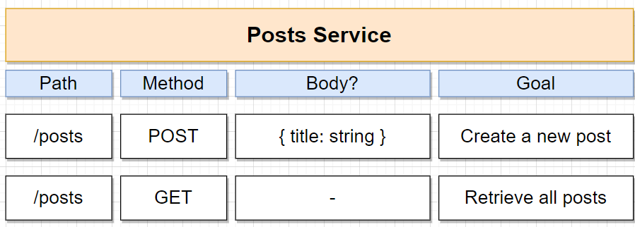
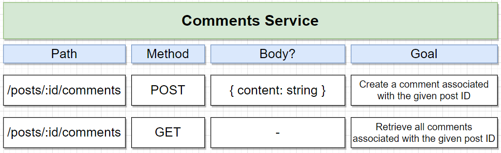
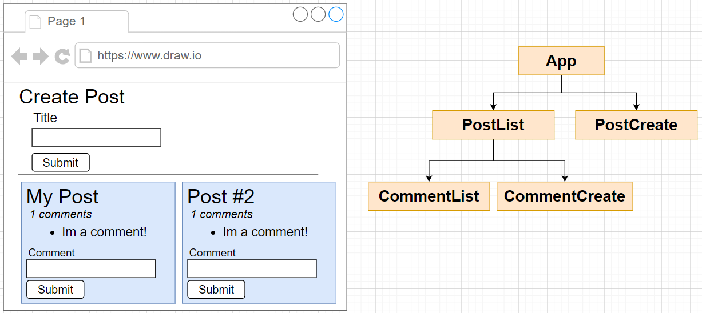

## Query problem

When we render page, each post, we will send a lots request to Comments service

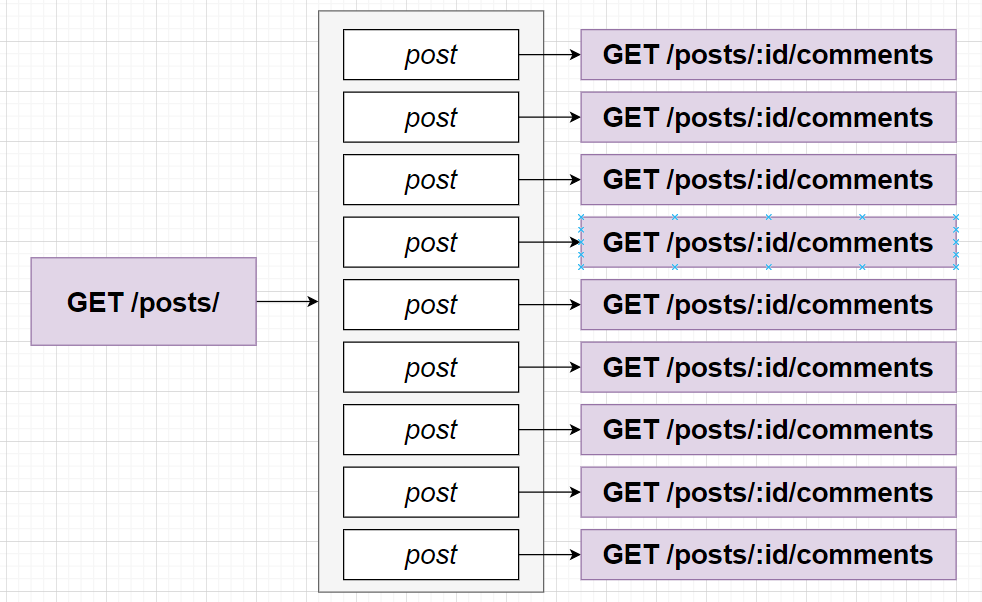

It's easy to fix with monolith DB by query all but how we can do that with microservices has its own DB

# Event bus

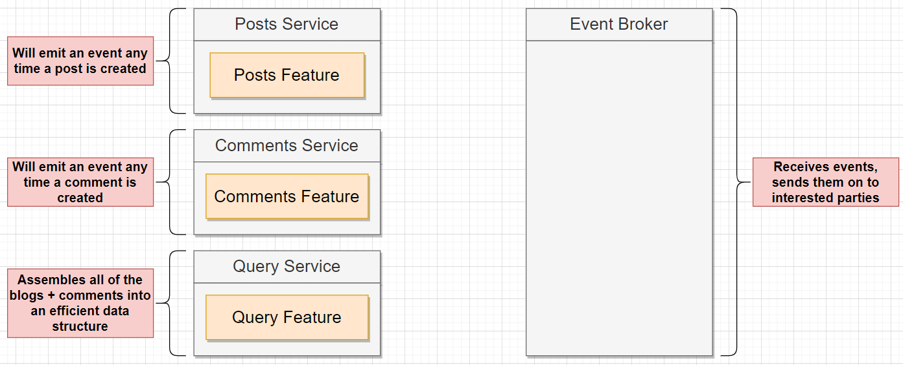
We create query service get all post and its comments in one reqquest 
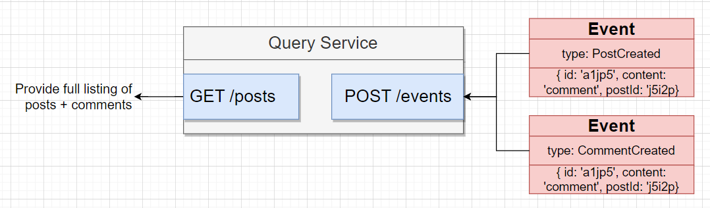
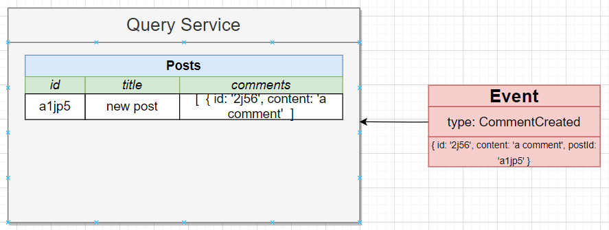

# Moderation service

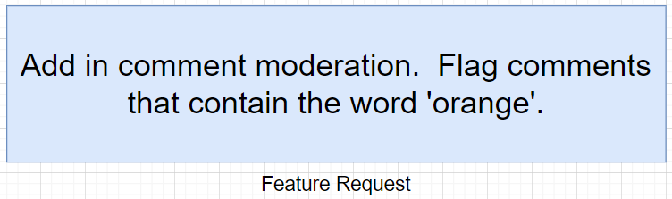
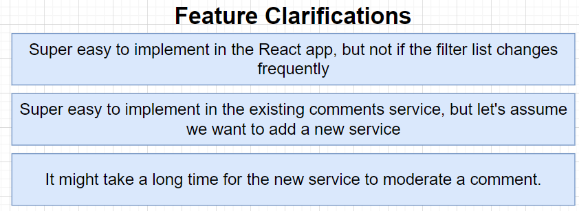
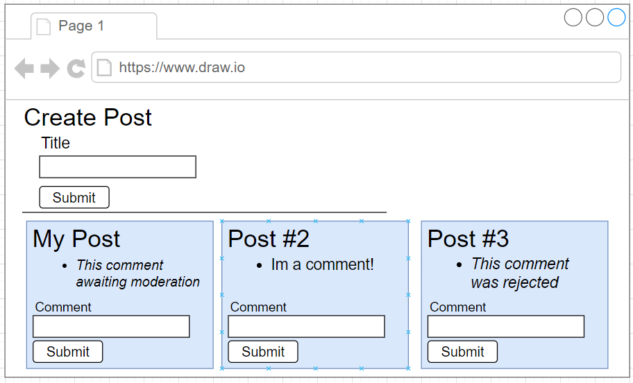
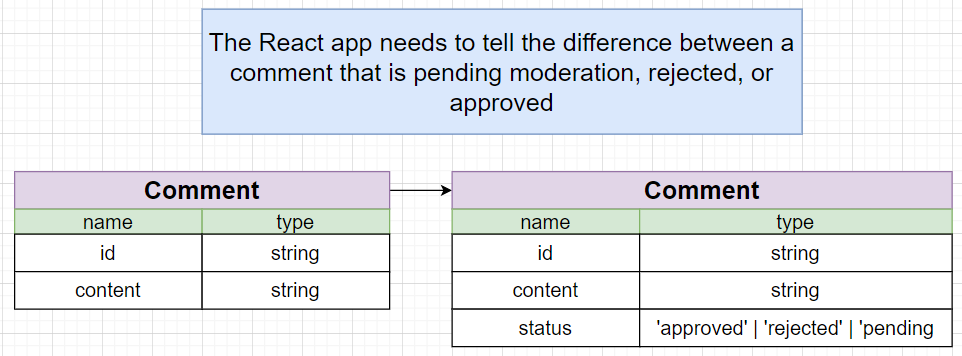

## Flow

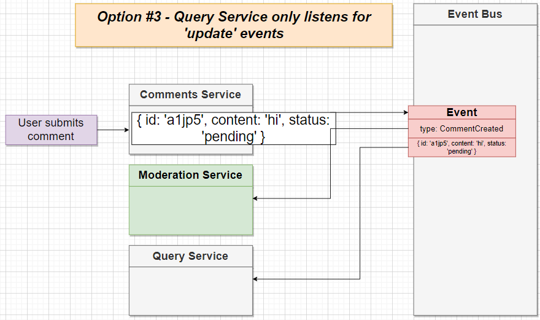
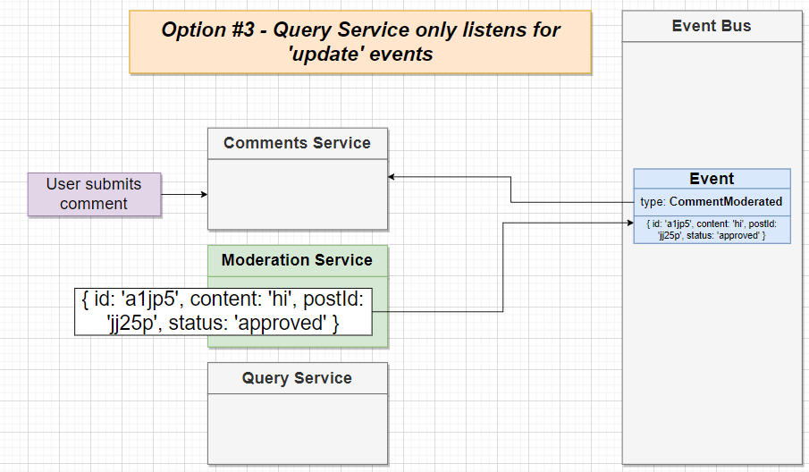
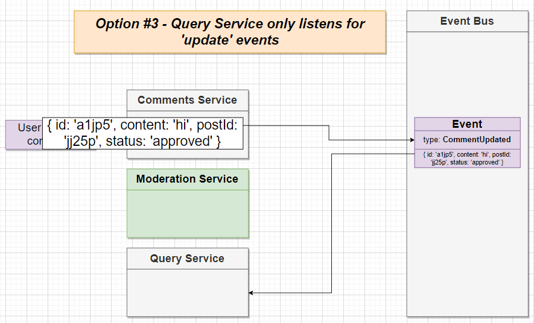
