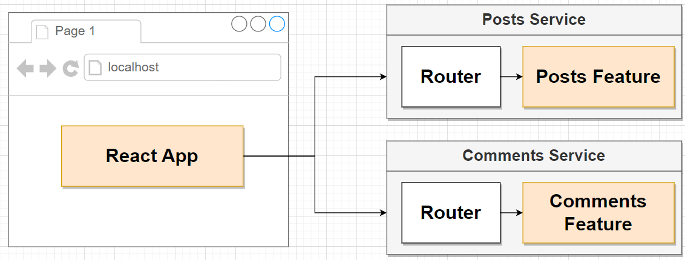

# Mockup

# Design

## Query problem

When we render page, each post, we will send a lots request to Comments service

It's easy to fix with monolith DB by query all but how we can do that with microservices has its own DB

# Event bus

We create query service get all post and its comments in one reqquest 

# Moderation service

## Flow

