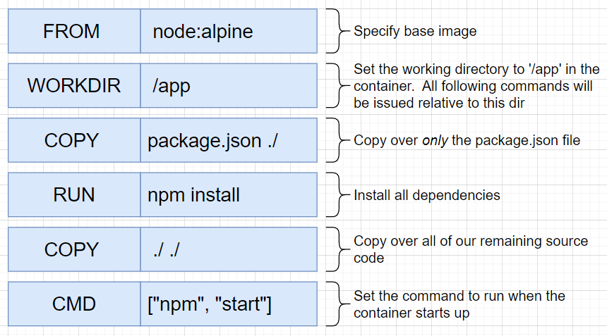
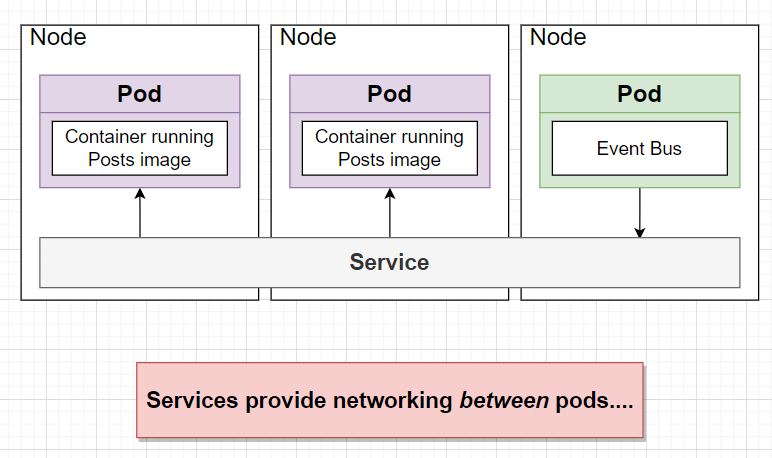

# Mockup

# Design

## Query problem

When we render page, each post, we will send a lots request to Comments service

It's easy to fix with monolith DB by query all but how we can do that with microservices has its own DB

# Event bus

We create query service get all post and its comments in one reqquest 

# Moderation service

## Flow

# Dealing with Missing Events

## Service is broken a period of time and then live again

## Service is just implemented after product worked a period of time

## Solution

# Docker

# K8s: Docker Desktop's Kuberentes

Check the version k8s client and server:
`kubectl version --short`

## Overview

- K8s will look up in your local machine docker image you built and setup it
- If it not available, then it will defualt looking out at Dokcer Hub

## Creating a pod

`/c/Workspace/blog/infra/k8s/posts.yml`

execute posts config file with: `kubectl apply -f posts.yaml`

when we run `kubectl exec -it ...`

- if we have more than one container inside this pod. It will ask us which container we wanna execute the command
- if not, it just run the command on the only container inside the pod

## service and networking

